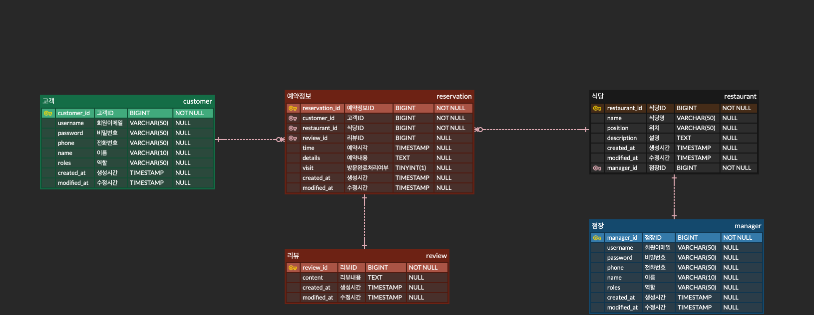

# Restaurant Table Reservation Service
식당 테이블을 예약하는 서비스입니다.


## ✨Description
- - -
### 사용된 기술
```
Language : Java JDK 17
Framework : Spring Boot 3.3.0
Build : Gradle
Database : MySQL

기타
인증/인가 구현 : Spring Security
데이터 유효성 검증 : Java Bean Validation
```

### 주요 기능
| 기능                                  | 권한     | 구현현황 |
|:------------------------------------|--------|:----:|
| 고객 회원가입 및 로그인                       | 비회원    |  O   |
| 점장 회원가입 및 로그인                       | 비회원    |  O   |
| 상점 검색 및 상세 검색                       | 고객     |      |
| 예약 등록                               | 고객     |      |
| (개인) 예약 조회                          | 고객     |      |
| 예약 이용 후 리뷰 등록 및 수정                  | 고객     |      |
| 상점 등록/조회/수정/제거                      | 점장     |  O   |
| 예약 수정(예약 후 손님이 10분전에 도착해서 도착 확인 가능) | 점장     |      |
| 예약 제거                               | 점장     |      |
| 매장에 등록된 모든 예약 조회                    | 점장     |      |
| 리뷰 삭제                               | 고객, 점장 |      |

### ERD



### 서비스 구성도


### API 명세서 (SWAGGER)
swagger 참조.

### Folder Structure
- `src`: 메인 로직
  `src`에는 주요 로직들이 있으며, 컨트롤러, 서비스 등을 담고 있다.
- `common`: 메인 로직은 아니지만 `src` 에서 필요한 부차적인 파일들을 모아놓은 폴더
    - `config`: 설정 파일 관련 폴더
    - `entity`: 공통 Entity 관리 폴더
    - `exceptions`: 예외처리 관리 폴더
    - `response`: baseResponse를 관리하는 폴더
    - `secret`: 보안과 관련된 파일 관리 폴더(차후 환경 변수로 분리 추천)
    - `constant`: 상수와 관련된 내용


- src 폴더 구조
> domain - model - service - web
>   > domain - entity

- `entity` : 해당 도메인에서 사용되는 엔티티 모음
- `domain` : 도메인을 의미하며, 레포지토리와 엔티티가 존재함.
- `model` : 해당 컨트롤러, 서비스, 레포지토리 레이어에서 사용할 DTO를 모음.
- `web`: 컨트롤러의 모음. Request를 처리하고 Response 해주는 곳. (Service에 넘겨주고 다시 받아온 결과값을 형식화), 형식적 Validation
- `service`: 서비스의 모음. 비즈니스 로직 처리, 논리적 Validation

## ✨Structure
앞에 (*)이 붙어있는 파일(or 폴더)은 추가적인 과정 이후에 생성된다.
```text
api-server-spring-boot
  > * build
  > gradle
  > src.main.java.com.example.demo
    > common
      > config
        | AppConfig.java
        | SecurityConfig // Web Security 관련 설정 (CORS 설정 포함)
        | RestTemplateConfig.java // HTTP get,post 요청을 날릴때 일정한 형식에 맞춰주는 template
        | SwaggerConfig.java // Swagger 관련 설정
      > constant // 상수 보관 패키지
        | Auth
        | Authority
      > entity
        | BaseEntity.java // create, update, state 등 Entity에 공통적으로 정의되는 변수를 정의한 BaseEntity
      > exceptions
        | BaseException.java // Controller, Service에서 Response 용으로 공통적으로 사용 될 익셉션 클래스
        | ExceptionAdvice.java // ExceptionHandler를 활용하여 정의해놓은 예외처리를 통합 관리하는 클래스
      > oauth
        | KakaoOauth.java // Kakao OAuth 처리 클래스
        | OAuthService.java // OAuth 공통 처리 서비스 클래스
        | SocialOauth.java // OAuth 공통 메소드 정의 인터페이스
      > response
        | BaseResponse.java // Controller 에서 Response 용으로 공통적으로 사용되는 구조를 위한 모델 클래스
        | BaseResponseStatus.java // Controller, Service에서 사용할 Response Status 관리 클래스 
      > secret
        | Secret.java // jwt 암호키 보관 클래스
    > src
      > board // 게시물 관련(피드, 댓글, 신고)
        > entity
          | Comment // 댓글
          | Post // 게시물
          | PostImgPath // 게시물에 첨부되는 이미지 
          | Report // 신고
         > repositories
         PostController.java
         PostService.java
      > pay // 결제 관련(결제, 구독)
        > entity
          | Order.java // 결제(주문) 
          | Subscribe.java // 구독
        > model
        > repository
        PayController.java
        PayService
      > user // 회원 정보 관련(회원가입, 회원정보)
        > entity
          | User.java // User Entity
        > model
          | .. 생략 
        | UserController.java
        | UserService.java
        | UserRepository.java
    > utils
      | JwtService.java // JWT 관련 클래스
      | SHA256.java // 암호화 알고리즘 클래스
      | ValidateRegex.java // 정규표현식 관련 클래스
    | RestaurantTableReservationApplication // SpringBootApplication 서버 시작 지점
  > resources
    | application.yml // Database 연동을 위한 설정 값 세팅 및 Port 정의 파일
build.gradle // gradle 빌드시에 필요한 dependency 설정하는 곳
.gitignore // git 에 포함되지 않아야 하는 폴더, 파일들을 작성 해놓는 곳

```
